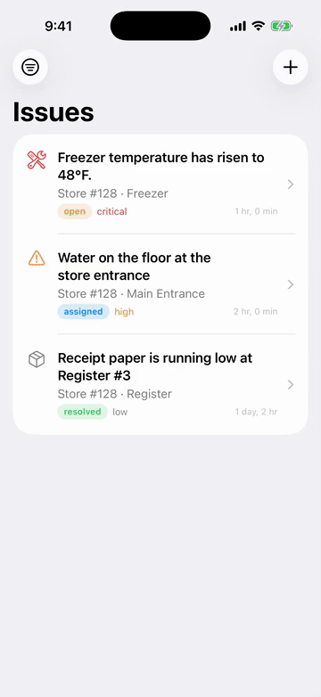

# OpsPilot

Offline-first field-operations app for store staff: report an issue on the floor, move it through a state machine, keep working without network.



**Stack** SwiftUI · SwiftData · Node/TypeScript · PostgreSQL — **Live** runs locally today (public API after Phase 8) — **Contact** you@example.com · [LinkedIn](https://linkedin.com/in/you)

<details><summary><b>Architecture (today)</b></summary>

iPhone (SwiftUI · SwiftData) --HTTPS/JSON--> API (Node 24 · TypeScript · Hono) --SQL--> PostgreSQL 17
The app reaches storage only through an `IssueRepository` protocol; today that is SwiftData, next it is the API behind an offline outbox.

</details>

<details><summary><b>Engineering notes</b></summary>

- Keyset pagination on `(created_at, id)` — no OFFSET, stable while rows are inserted
- Optimistic locking (`WHERE version = $n` → 409) and a server-enforced state machine (422 on illegal transitions)
- One error envelope `{ error: { code, message, details } }` so clients branch on codes, not prose
- Integration tests hit a real PostgreSQL through `app.request()` — no port, no mocks
- Domain model separated from the persistence model on iOS; the repository was swapped without touching a view
- Next: auth with short-lived access tokens → outbox sync with rotating idempotency keys and `(updated_at, id)` delta cursors → Lambda + CDK inside always-free limits

</details>

<details><summary><b>Why not X?</b></summary>

See [docs/decisions.md](docs/decisions.md): SwiftData vs Core Data/Realm, Hono vs Express, SQL vs an ORM, PostgreSQL vs DynamoDB/Firebase, hand-rolled JWT vs Cognito/Auth0, Lambda vs ECS/Vercel/Render.

</details>

<details><summary><b>Run locally</b></summary>

```sh
cd api && npm install && npm run db:up && cp .env.example .env && npm run migrate && npm run dev
open ios/OpsPilot/OpsPilot.xcodeproj    # then ⌘R
```

</details>

**Status** [x] iOS MVP · [x] SwiftData persistence · [x] REST API + PostgreSQL + tests · [ ] Auth (JWT/RBAC) · [ ] Offline sync · [ ] Observability + CI · [ ] AWS Lambda demo · [ ] React dashboard
